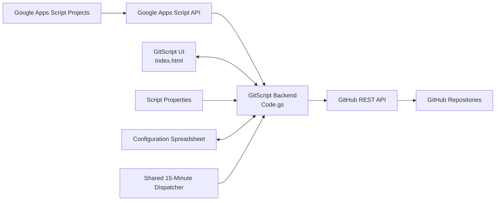
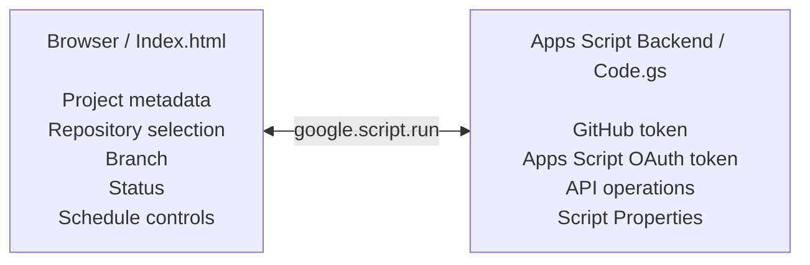
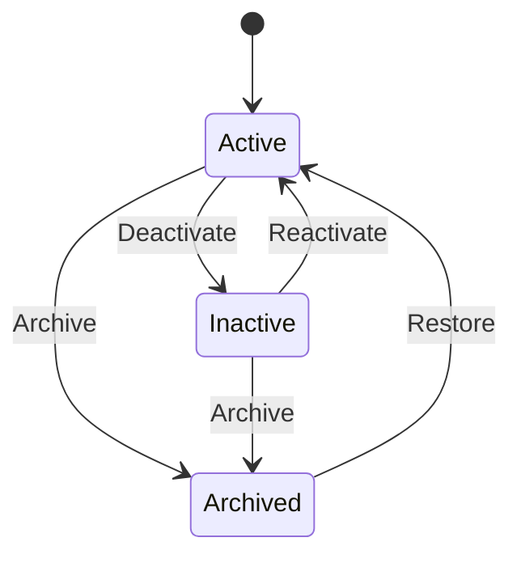
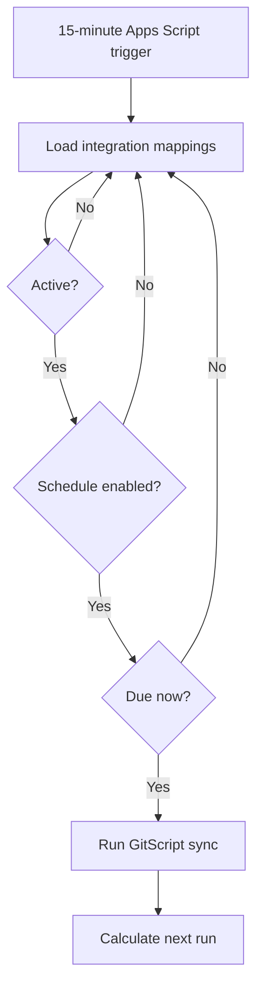
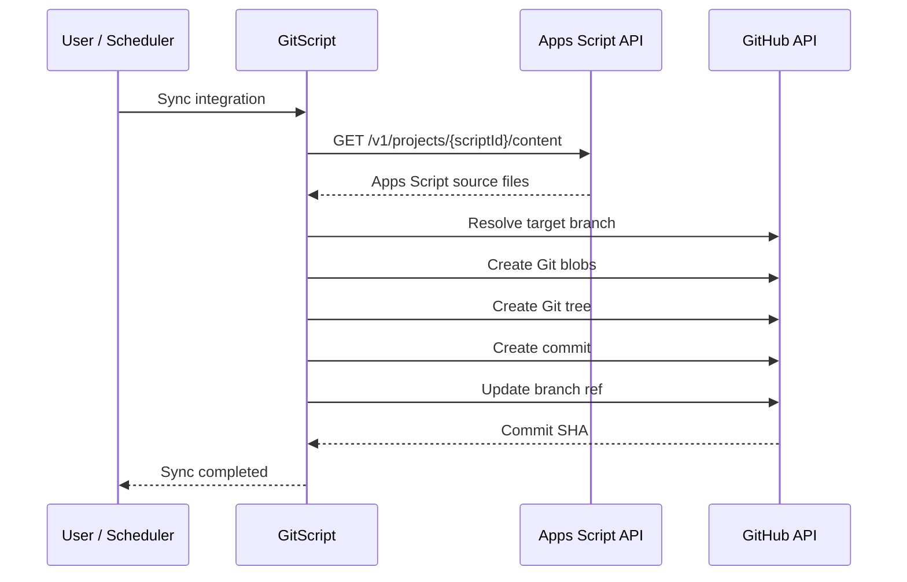

# GitScript™

### Google Apps Script → GitHub Cloud Sync

GitScript is a self-hosted control plane for mapping **Google Apps Script projects to GitHub repositories**, synchronizing source code on demand or on a schedule, and bringing cloud-hosted Apps Script projects into a more conventional Git-based development workflow.

It is designed for developers, product builders, consultants, agencies, and internal-tool teams that rely on Google Apps Script but want stronger source control, backup, repository organization, and operational visibility.

> **Current version:** v1.2  
> **Runtime:** Google Apps Script V8  
> **Frontend:** Single-file HTML interface  
> **Primary integrations:** Google Apps Script API + GitHub REST API

---

## Table of Contents

- [Why GitScript](#why-gitscript)
- [What GitScript Does](#what-gitscript-does)
- [Key Features](#key-features)
- [How It Works](#how-it-works)
- [Architecture](#architecture)
- [Integration Lifecycle](#integration-lifecycle)
- [Scheduling](#scheduling)
- [Repository Structure](#repository-structure)
- [Requirements](#requirements)
- [Installation](#installation)
- [Google Cloud Setup](#google-cloud-setup)
- [GitHub Setup](#github-setup)
- [Script Properties](#script-properties)
- [Deployment](#deployment)
- [Creating Your First Mapping](#creating-your-first-mapping)
- [Sync Behavior](#sync-behavior)
- [Configuration Store](#configuration-store)
- [OAuth Scopes](#oauth-scopes)
- [Security](#security)
- [Secret Detection and GitHub Push Protection](#secret-detection-and-github-push-protection)
- [Troubleshooting](#troubleshooting)
- [Current Limitations](#current-limitations)
- [Suggested Roadmap](#suggested-roadmap)
- [Contributing](#contributing)
- [License](#license)
- [Third-Party Services](#third-party-services)

---

# Why GitScript

Google Apps Script makes it unusually fast to build:

- internal business tools;
- Google Workspace automations;
- lightweight SaaS products;
- dashboards;
- administrative interfaces;
- integrations;
- workflow utilities; and
- client applications.

But Apps Script source code often remains isolated inside Google's cloud editor.

That can create friction when a project becomes important enough to need:

- GitHub backup;
- structured version history;
- repository-based collaboration;
- code review;
- documentation;
- downstream automation;
- disaster recovery;
- client handoff;
- archival;
- or a cleaner engineering workflow.

GitScript creates a bridge between those environments.

```text
Google Apps Script
       │
       │  Apps Script API
       ▼
   GitScript
       │
       │  GitHub REST API
       ▼
GitHub Repository
```

You continue using Apps Script as the application runtime while GitScript gives the source code a managed route into GitHub.

---

# What GitScript Does

GitScript lets you create reusable **integration mappings**.

Each mapping connects:

```text
Project Nickname
        +
Apps Script Script ID
        +
GitHub Repository
        +
Target Branch
        =
Integration Stream
```

For example:

```text
VoteTXK
1AbCdEfGhIjKlMnOpQrStUvWxYz
ByMarkAllan/VoteTXK
main
```

Once mapped, GitScript can retrieve the Apps Script source and push it into the configured GitHub branch.

A single GitScript installation can manage multiple independent Apps Script projects.

---

# Key Features

## Apps Script → GitHub synchronization

Retrieve project source using the Google Apps Script API and publish the source into a mapped GitHub repository.

GitScript converts Apps Script file types into normal repository filenames:

| Apps Script type | GitHub file |
|---|---|
| Server-side JavaScript | `.gs` |
| HTML | `.html` |
| JSON / manifest | `.json` |

---

## Multi-project control plane

One GitScript installation can manage many Apps Script projects.

You do **not** need to create a separate GitScript installation or Google Cloud project for every target script.

```text
                    GitScript
                       │
          ┌────────────┼────────────┐
          ▼            ▼            ▼
       VoteTXK     RanchAssist   UnScriptly
          │            │            │
          ▼            ▼            ▼
       GitHub        GitHub        GitHub
```

---

## Repository discovery

GitScript loads GitHub repositories that the configured token can access and push to.

The setup wizard can use existing repositories or create a new repository directly through the GitHub API.

---

## Branch targeting

Each integration can target a specific GitHub branch.

Examples:

```text
main
production
staging
apps-script
backup
```

If the target branch does not yet exist, GitScript attempts to create it from the repository's default branch.

---

## Manual synchronization

Each active integration includes a **Sync Now** action.

A manual synchronization:

1. validates the integration state;
2. requests project source from the Apps Script API;
3. creates Git blobs;
4. builds a Git tree;
5. creates a Git commit;
6. updates the target branch reference; and
7. records synchronization state.

---

## Scheduled synchronization

GitScript supports automated synchronization using one shared Apps Script time-based dispatcher.

Available schedule types:

### Recurring interval

```text
Every 1 hour
Every 2 hours
Every 4 hours
Every 6 hours
Every 12 hours
Every 24 hours
```

### Daily

Example:

```text
Every day
8:00 AM
America/Chicago
```

### Weekly

Example:

```text
Every Monday
8:00 AM
America/Chicago
```

Weekly schedules support:

- Sunday;
- Monday;
- Tuesday;
- Wednesday;
- Thursday;
- Friday; and
- Saturday.

GitScript uses one shared 15-minute dispatcher rather than creating one trigger per integration.

---

## Integration lifecycle controls

Each integration can be placed into one of three states:

### Active

The integration is operational.

- Manual sync enabled
- Scheduled sync enabled
- Mapping retained

### Inactive

The integration is temporarily paused.

- Manual sync blocked
- Scheduled sync paused
- Mapping retained
- Schedule retained

Reactivate the integration when it should resume.

### Archived

The integration is removed from active operations but preserved for reference.

- Manual sync blocked
- Scheduled sync excluded
- Mapping retained
- Archive timestamp recorded

Archived integrations can later be restored.

---

## Inline operational status

GitScript tracks information such as:

- current sync status;
- latest push;
- latest error;
- next scheduled synchronization;
- last scheduled synchronization;
- lifecycle state;
- repository;
- branch; and
- project Script ID.

---

## Self-hosted architecture

GitScript runs as a Google Apps Script web application.

That means you do not need to maintain a traditional web server for the core application.

The architecture uses:

```text
Index.html
    │
    │ google.script.run
    ▼
Code.gs
    │
    ├── Apps Script API
    ├── GitHub API
    ├── Script Properties
    ├── Google Sheets configuration store
    └── Apps Script time-based triggers
```

---

# How It Works

## 1. Connect the GitScript installation

Configure GitScript once with:

- a standard Google Cloud project;
- Google Apps Script API access;
- GitHub authentication; and
- the required Apps Script OAuth scopes.

---

## 2. Add an Apps Script project

Paste either:

- the Apps Script **editor URL**; or
- the project's **Script ID**.

Example editor URL:

```text
https://script.google.com/home/projects/1AbCdEfGhIjKlMnOpQrStUvWxYz/edit
```

GitScript extracts the Script ID automatically.

### Do not use the deployed Web App URL

This is **not** valid:

```text
https://script.google.com/macros/s/AKfycbxxxxxxxx/exec
```

`AKfy...` identifies a deployment, not the Apps Script project itself.

To obtain the correct identifier:

```text
Apps Script
→ Project Settings
→ IDs
→ Script ID
→ Copy
```

---

## 3. Select the GitHub destination

Choose:

```text
Repository
Branch
```

Example:

```text
ByMarkAllan/VoteTXK
main
```

---

## 4. Initialize the mapping

GitScript validates both ends before saving the integration:

```text
Apps Script access  ✓
GitHub repository   ✓
Mapping unique      ✓
```

---

## 5. Synchronize

Click **Sync Now** or configure an automatic schedule.

---

# Architecture



## Trust boundary

The browser is intentionally not responsible for storing private GitHub credentials.



Private authentication should remain in the Apps Script backend.

---

# Integration Lifecycle

GitScript treats operational state separately from synchronization state.

An integration may be:

```text
active
inactive
archived
```

While sync status may independently be:

```text
ready
error
```

This distinction allows an integration to be intentionally paused even if its last synchronization was successful.

## State transitions



---

# Scheduling

GitScript uses a **single shared time-based trigger**:

```text
runScheduledSyncs
```

The Apps Script trigger runs every:

```text
15 minutes
```

At each dispatcher run, GitScript evaluates the active integrations and determines which ones are due.

This architecture avoids creating a separate Apps Script trigger for every mapping.



## Scheduler timezone

GitScript reads:

```text
SCHEDULE_TIMEZONE
```

from Script Properties.

If the property is omitted, the Apps Script project's timezone is used.

Recommended example:

```text
America/Chicago
```

Use a valid IANA timezone.

---

# Repository Structure

For a normal Apps Script source repository:

```text
GitScript/
├── Code.gs
├── Index.html
├── appsscript.json
├── README.md
└── LICENSE               # optional / based on your distribution model
```

If you received GitScript as exported `.txt` files, rename the files when adding them to Apps Script:

```text
Code.gs.txt          → Code.gs
Index.html.txt       → Index.html
appsscript.json.txt  → appsscript.json
```

---

# Requirements

Before installing GitScript, you should have:

- a Google account;
- access to Google Apps Script;
- a standard Google Cloud project you control;
- Google Apps Script API enabled;
- Apps Script API access enabled for your Google account;
- a GitHub account;
- a GitHub token with permissions appropriate for the repositories you will manage; and
- access to every Apps Script project you intend to synchronize.

---

# Installation

## Step 1 — Create the GitScript Apps Script project

Create a standalone Apps Script project.

Add:

```text
Code.gs
Index.html
appsscript.json
```

Paste the corresponding GitScript source into each file.

---

# Google Cloud Setup

GitScript's Google Cloud configuration is performed **once for the GitScript installation**, not once for every target Apps Script project.

## Step 1 — Create a standard Google Cloud project

Create a new Google Cloud project.

Example:

```text
Project name:
GitScript

Project ID:
gitscript-cloud

Project number:
123456789012
```

The important value for connecting Apps Script is the numeric **Project Number**.

---

## Step 2 — Enable the Google Apps Script API

Inside the Google Cloud project:

```text
Google Cloud Console
→ APIs & Services
→ Library
→ Google Apps Script API
→ Enable
```

---

## Step 3 — Configure Google Auth / OAuth

Configure the Google Auth Platform / OAuth consent screen as required for your deployment.

For a private development installation, configure the appropriate test users while the application remains in testing.

OAuth requirements may differ for public or Workspace deployments.

---

## Step 4 — Associate GitScript with the Cloud project

Open the **GitScript Apps Script project**.

Go to:

```text
Project Settings
→ Google Cloud Platform (GCP) Project
→ Change project
```

Paste the **numeric Google Cloud Project Number**.

Example:

```text
123456789012
```

Do not put this number into `Code.gs` or Script Properties merely to associate the projects.

The association is managed through Apps Script Project Settings.

---

## Step 5 — Enable Apps Script API access for the Google account

Open the Apps Script account settings and enable:

```text
Google Apps Script API
```

This account-level setting is separate from enabling the API in Google Cloud.

---

# GitHub Setup

GitScript communicates with GitHub using the REST API.

Create an appropriate:

- fine-grained personal access token;
- classic personal access token; or
- other supported GitHub credential strategy suitable for your environment.

The token must have sufficient permission for the operations you expect GitScript to perform.

Depending on usage, GitScript may need to:

- list repositories;
- read repository metadata;
- create repositories;
- read Git refs;
- create branches;
- create Git blobs;
- create Git trees;
- create commits; and
- update branch refs.

Exact GitHub permissions depend on:

- token type;
- repository ownership;
- public vs. private repositories;
- organization policies;
- branch rules; and
- whether repository creation is used.

Follow the principle of least privilege.

---

# Script Properties

Open:

```text
Apps Script
→ Project Settings
→ Script Properties
```

## Required

### `GITHUB_TOKEN`

```text
GITHUB_TOKEN = github-token-value
```

GitScript uses this server-side for GitHub API requests.

**Never place this value in `Index.html`.**

---

## Optional

### `GITHUB_OWNER`

Defines the default GitHub user or organization used by the **Create Repository** feature.

```text
GITHUB_OWNER = YourGitHubUsernameOrOrg
```

If omitted, GitScript uses the authenticated GitHub user.

---

### `CONFIG_SPREADSHEET_ID`

Specifies an existing Google Spreadsheet used as GitScript's configuration store.

```text
CONFIG_SPREADSHEET_ID = spreadsheet-id
```

If omitted, GitScript automatically creates:

```text
GitScript — Configuration
```

and stores the new spreadsheet ID in Script Properties.

---

### `SCHEDULE_TIMEZONE`

Overrides the Apps Script project timezone for schedule calculations.

```text
SCHEDULE_TIMEZONE = America/Chicago
```

If omitted, GitScript uses the Apps Script project's timezone.

---

## Recommended Script Properties summary

| Property | Required | Purpose |
|---|---:|---|
| `GITHUB_TOKEN` | Yes | GitHub API authentication |
| `GITHUB_OWNER` | No | Default repo owner / organization |
| `CONFIG_SPREADSHEET_ID` | No | Existing configuration spreadsheet |
| `SCHEDULE_TIMEZONE` | No | Scheduler timezone override |

The Google Cloud Project Number is **not** a Script Property requirement.

---

# Deployment

After configuration:

```text
Deploy
→ New deployment
→ Web app
```

Choose an execution identity that has access to every Apps Script project GitScript is expected to read.

Access settings should match your intended deployment model.

After changing OAuth scopes, Cloud project association, or trigger permissions, Google may require reauthorization.

When updating the application:

```text
Deploy
→ Manage deployments
→ Edit
→ New version
→ Deploy
```

Reload the web application afterward.

---

# Creating Your First Mapping

Open GitScript.

The setup wizard asks for:

### Project Nickname

Example:

```text
VoteTXK
```

### GAS Project Link

Paste either:

```text
Apps Script editor URL
```

or:

```text
Script ID
```

### Target GitHub Repo

Example:

```text
ByMarkAllan/VoteTXK
```

### Target Branch

Example:

```text
main
```

Then choose:

```text
Initialize Mapping
```

GitScript validates the Apps Script project and GitHub repository before saving the mapping.

Duplicate active/inactive routes using the same:

```text
Script ID + Repository + Branch
```

are rejected.

Archived mappings do not prevent creation of a new route.

---

# Sync Behavior

When an active mapping is synchronized, GitScript performs the following workflow:



Manual commit message:

```text
Sync Apps Script source via GitScript
```

Scheduled commit message:

```text
Scheduled Apps Script sync via GitScript
```

---

# Configuration Store

GitScript uses a Google Spreadsheet as its integration registry.

Default spreadsheet:

```text
GitScript — Configuration
```

Default worksheet:

```text
Sync Configurations
```

The current schema includes:

```text
ID
Nickname
Script ID
Repository
Branch
Created At
Last Push
Sync Status
Lifecycle
Last Error
Schedule Enabled
Schedule Type
Schedule Interval Hours
Schedule Hour
Schedule Weekday
Schedule Timezone
Next Scheduled Sync
Last Scheduled Sync
Archived At
```

GitScript includes a non-destructive schema migration routine.

When new supported columns are added, GitScript appends missing columns while preserving existing mapping data.

---

# OAuth Scopes

The current `appsscript.json` uses:

```json
{
  "oauthScopes": [
    "https://www.googleapis.com/auth/script.external_request",
    "https://www.googleapis.com/auth/script.projects.readonly",
    "https://www.googleapis.com/auth/script.scriptapp",
    "https://www.googleapis.com/auth/spreadsheets",
    "https://www.googleapis.com/auth/userinfo.email"
  ]
}
```

## Why they are needed

### `script.external_request`

Allows GitScript to call external services such as:

```text
GitHub REST API
Google Apps Script API
```

### `script.projects.readonly`

Allows GitScript to retrieve authorized Apps Script project source.

### `script.scriptapp`

Allows GitScript to create and remove its shared installable scheduler trigger.

### `spreadsheets`

Allows GitScript to maintain the integration configuration spreadsheet.

### `userinfo.email`

Allows the interface to display the connected Google profile email.

Do not broaden scopes unless a feature genuinely requires additional access.

---

# Security

GitScript is designed around a server-side credential boundary.

## Keep credentials out of the frontend

Do not place secrets in:

```text
Index.html
client-side JavaScript
browser localStorage
browser sessionStorage
URLs
console output
public repository files
```

Private application configuration should remain server-side.

---

## Protect the GitHub token

Store:

```text
GITHUB_TOKEN
```

only in Script Properties or a stronger secret-storage mechanism if you extend the architecture.

---

## Use least-privilege OAuth and GitHub scopes

Only authorize the capabilities GitScript actually needs.

---

## Protect the Google account

Recommended:

- multi-factor authentication;
- careful OAuth review;
- controlled Apps Script sharing;
- controlled Cloud IAM membership; and
- regular credential rotation.

---

## Protect source code before publishing

GitScript synchronizes source code.

That source may contain:

- API keys;
- passwords;
- OAuth secrets;
- private URLs;
- customer data;
- service-account credentials;
- tokens;
- private keys;
- database credentials; or
- other confidential values.

Review the source before syncing to a public repository.

---

# Secret Detection and GitHub Push Protection

GitHub may reject a GitScript commit when repository rules or push protection detect a credential.

Example:

```text
GitHub API error (422):
Repository rule violations found
Secret detected in content
```

This means GitScript reached GitHub successfully, but GitHub refused the source because a file appears to contain a secret.

## Recommended fix

Move the secret out of Apps Script source code.

Instead of:

```javascript
const API_KEY = 'real-secret-value';
```

use Apps Script Script Properties:

```javascript
function getApiKey_() {
  return PropertiesService
    .getScriptProperties()
    .getProperty('API_KEY');
}
```

Then configure:

```text
API_KEY = real-secret-value
```

under Apps Script Project Settings → Script Properties.

Because GitScript retrieves source files—not Script Properties—the secret remains outside the Git repository.

```text
Apps Script
│
├── Code.gs
│   └── getProperty("API_KEY") ───────► GitHub
│
└── Script Properties
    └── API_KEY = actual-secret ──────X GitHub
```

Do not disable GitHub secret protection simply to make synchronization succeed unless you fully understand the risk.

---

# Troubleshooting

## 403 — Apps Script API has not been used or is disabled

Example:

```text
Apps Script API error (403):
Apps Script API has not been used in project ... before or it is disabled.
```

### Cause

The GitScript Apps Script project is attached to a Cloud project where the Apps Script API is not enabled, or authorization/configuration is incomplete.

### Fix

Confirm:

1. GitScript is attached to a **standard Google Cloud project**.
2. The **Google Apps Script API** is enabled in that project.
3. Apps Script API access is enabled in the Google account settings.
4. OAuth authorization has been completed.
5. The execution identity can access the target Apps Script project.

---

## 400 — Request contains an invalid argument

Example:

```text
Apps Script API error (400):
Request contains an invalid argument.
```

### Common cause

A Web App deployment ID was supplied instead of the Apps Script project Script ID.

Wrong:

```text
AKfycbxxxxxxxxxxxxxxxx
```

Wrong:

```text
https://script.google.com/macros/s/AKfycbxxxxxxxx/exec
```

Correct:

```text
Apps Script → Project Settings → Script ID
```

GitScript v1.2 explicitly rejects common `AKfy...` deployment identifiers.

---

## 404 — Apps Script project not found

Confirm:

- the Script ID is correct;
- the project still exists; and
- the Google account running GitScript has access to it.

---

## 422 — GitHub repository rule violation / secret detected

GitHub push protection rejected source content.

Search the Apps Script source for embedded secrets and move them to Script Properties.

---

## GitHub repository does not appear in the dropdown

Check:

- token permissions;
- repository ownership;
- organization authorization;
- token expiration;
- SSO requirements; and
- whether the token has push access.

GitScript filters the returned repository list to repositories where GitHub reports push permission.

---

## New repository creation fails

Confirm the GitHub token is authorized to create repositories for the configured owner.

If using:

```text
GITHUB_OWNER
```

and it identifies an organization, the authenticated user/token must have appropriate organization permissions.

---

## Schedule does not run

Confirm:

1. Integration lifecycle is `active`.
2. Schedule is enabled.
3. `script.scriptapp` OAuth scope is authorized.
4. A `runScheduledSyncs` project trigger exists.
5. `SCHEDULE_TIMEZONE` is correct, if configured.
6. The GitScript execution identity still has access to Google and GitHub.
7. The Apps Script project's trigger quota has not been exceeded.

GitScript evaluates schedules approximately every 15 minutes.

A schedule such as:

```text
Monday at 8:00 AM
```

should be interpreted as running during the dispatcher window near that time—not at an exact second.

---

## Integration is inactive

Manual and automatic synchronization are intentionally blocked.

Choose:

```text
Reactivate
```

to resume operations.

---

## Integration is archived

Restore the integration before modifying its schedule or synchronizing it.

---

# Current Limitations

GitScript v1.2 is intentionally focused.

Current architecture is primarily:

```text
Apps Script → GitHub
```

It should not be assumed to provide:

- bidirectional synchronization;
- GitHub → Apps Script restore;
- merge conflict resolution;
- pull-request creation;
- diff review before sync;
- secret scanning before contacting GitHub;
- `.gitscriptignore`;
- webhook-driven synchronization;
- per-file include/exclude rules;
- automatic rollback;
- deployment management;
- Apps Script version/deployment synchronization; or
- full CI/CD orchestration.

GitHub's own repository rules and secret protection may still reject a commit after GitScript creates the Git objects.

---

# Suggested Roadmap

Potential future improvements include:

## Secret Guard

Scan source before GitHub API submission and report potential secret type + filename without exposing the secret itself.

---

## `.gitscriptignore`

Allow specific project files to be excluded from synchronization.

Example:

```text
LocalConfig.gs
DevelopmentOnly.gs
```

Script Properties should remain the preferred location for actual credentials.

---

## Diff preview

Show:

```text
Added
Modified
Removed
```

before committing.

---

## GitHub → Apps Script restore

Restore a selected repository commit into an Apps Script project.

This would require carefully designed write scopes, conflict handling, and explicit confirmation.

---

## Commit history inside GitScript

Display recent synchronized commits directly on each integration card.

---

## Scheduled sync history

Maintain a structured history of:

- scheduled attempts;
- successful commits;
- failures;
- runtime;
- file count; and
- error classification.

---

## Notifications

Optional alerts for:

```text
Sync succeeded
Sync failed
GitHub secret protection blocked a push
Authorization expired
Target project became inaccessible
```

---

## Integration health checks

A dedicated setup/health screen could test:

```text
Google Cloud project      ✓
Apps Script API           ✓
Google authorization      ✓
GitHub authentication     ✓
Configuration spreadsheet ✓
Scheduler trigger         ✓
```

---

# Development Notes

The frontend communicates with Apps Script through:

```javascript
google.script.run
```

Core public backend functions include:

```text
getConnectedProfileEmail()
getGitHubRepositories()
createGitHubRepository()
getSyncConfigurations()
saveSyncConfiguration()
syncNow()
deactivateIntegration()
reactivateIntegration()
archiveIntegration()
restoreIntegration()
getSchedulerInfo()
setIntegrationSchedule()
clearIntegrationSchedule()
```

The scheduled trigger calls:

```text
runScheduledSyncs()
```

Private/internal helper functions use a trailing underscore convention where appropriate.

---

# Data Model

A public integration object contains information similar to:

```json
{
  "id": "uuid",
  "nickname": "VoteTXK",
  "scriptId": "1AbCdEf...",
  "repository": "ByMarkAllan/VoteTXK",
  "branch": "main",
  "lifecycle": "active",
  "syncStatus": "ready",
  "lastPush": "2026-08-28T15:30:00.000Z",
  "lastError": "",
  "schedule": {
    "enabled": true,
    "type": "weekly",
    "intervalHours": null,
    "hour": 8,
    "weekday": 1,
    "timezone": "America/Chicago",
    "nextRun": "2026-08-31T13:00:00.000Z",
    "lastRun": null
  }
}
```

Exact timestamps depend on timezone and runtime state.

---

# Operational Model

GitScript is designed to separate:

## Platform setup

Performed once:

```text
Google Cloud project
Apps Script API
OAuth scopes
GitHub token
Configuration store
```

from:

## Project mapping

Repeated whenever another Apps Script project is added:

```text
Nickname
Script ID
GitHub repository
Branch
Schedule
```

This distinction is central to the product architecture.

---

# Privacy Model

GitScript is self-hosted.

Depending on configuration, operational data is stored within infrastructure controlled by the installation operator, including:

- Google Apps Script;
- Script Properties;
- Google Sheets; and
- GitHub.

Private GitHub credentials are intended to remain server-side.

Operators should review the repository's Privacy Policy and Terms of Service before providing GitScript to third-party users or clients.

---

# Contributing

If you maintain GitScript collaboratively:

1. create a branch;
2. make focused changes;
3. avoid committing secrets;
4. test both Apps Script and GitHub API behavior;
5. verify lifecycle transitions;
6. verify manual and scheduled synchronization;
7. document required OAuth changes; and
8. submit a pull request with a concise explanation of the change.

Recommended areas for contributions include:

- error classification;
- setup diagnostics;
- secret detection;
- test coverage;
- accessibility;
- scheduler reliability;
- GitHub App authentication; and
- restore/diff workflows.

---

# Suggested Testing Checklist

Before publishing a release, test:

### Setup

- [ ] GitHub repositories load.
- [ ] Connected Google email displays.
- [ ] Missing GitHub token produces an actionable error.
- [ ] Configuration spreadsheet initializes automatically.

### Mapping

- [ ] Valid editor URL extracts Script ID.
- [ ] Raw Script ID works.
- [ ] `AKfy...` deployment ID is rejected.
- [ ] Web App deployment URL is rejected.
- [ ] Duplicate live mapping is rejected.

### Synchronization

- [ ] Existing `main` branch syncs.
- [ ] Alternate branch syncs.
- [ ] Missing branch is created.
- [ ] Last Push updates.
- [ ] Sync errors persist safely.

### Lifecycle

- [ ] Active → Inactive.
- [ ] Inactive → Active.
- [ ] Active → Archived.
- [ ] Inactive → Archived.
- [ ] Archived → Active / Restore.
- [ ] Inactive manual sync is blocked.
- [ ] Archived manual sync is blocked.

### Scheduling

- [ ] 1-hour interval.
- [ ] 4-hour interval.
- [ ] Daily schedule.
- [ ] Sunday weekly schedule.
- [ ] Monday weekly schedule.
- [ ] Saturday weekly schedule.
- [ ] Schedule is retained while inactive.
- [ ] Archived integration does not run.
- [ ] Shared dispatcher trigger is removed when no active schedules remain.

### Security

- [ ] GitHub token is absent from frontend source.
- [ ] GitHub token is absent from logs.
- [ ] Script Properties are not returned wholesale to the browser.
- [ ] Repository push protection failure is handled without exposing the detected secret.

---

# License

No license terms are implied merely by publishing source code.

If this repository does not contain a `LICENSE` file, copyright law generally reserves the code owner's rights by default.

Before publicly distributing, selling, sublicensing, or accepting external contributions to GitScript, add an appropriate license that reflects the intended business model.

---

# Third-Party Services

GitScript is an independent project and is not an official Google or GitHub product.

Google Apps Script, Google Cloud, Google Workspace, and related marks are trademarks of Google LLC.

GitHub and related marks are trademarks of GitHub, Inc.

Use of Google and GitHub services remains subject to their respective:

- terms;
- API policies;
- acceptable-use rules;
- quotas;
- authentication requirements; and
- organization policies.

Third-party API behavior may change independently of GitScript.

---

# Disclaimer

GitScript synchronizes source code between external systems. Always maintain independent backups and review repository visibility, credentials, permissions, and source content before synchronization.

No synchronization system should be treated as the sole backup for critical source code.

---

<p align="center">
  <strong>GitScript™</strong><br>
  Keep the speed of Apps Script. Add the discipline of Git.
</p>
